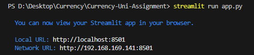

# Currency Converter Using Python #
# COIN SWAP - WebApp for Currency Conversion #


## Author
<h3>Name: Siddharth Arora<br>
Student ID: 25106954</h3>

## Description

**CoinSwap** is a web-application that was designed to make currency conversion easy and quick. It serves a variety of use cases, from casual purposes like assisting travelers and shoppers, to more business-oriented needs, such as supporting international traders and financial planners.

### Features
- Interactive and Easy to use User Interface (UI) through dropdown menus and calendar
- Application offers a wide range of over 30 currencies for current conversions 
- For traders and business use case, the application offers historical conversions and inverse rates where users can select past dates and check rates.
- The rates are fetched from a credible source (European Central Bank) through Frankfurter API thus ensuring data accuracy
- Data is refreshed everyday at 1600 CET (12 AM AEST (Syd)) 

### Challenges
- Integration of external APIs and error handling. 
- Integrating raw data into the application to display it in a more user friendly output.
- Frankfurter being an open source API can lead to a lack of technical support and potential compatibility issues in the future.
- Designing a smooth user interface to make it easy to use for casual users as well as detailed one for more professional users.

### Future Features
- More information in the form of trend visualisations
- Realtime data updates for an extremely accurate conversion.
- A profile based system where users can save and bookmark their favourite currencies.
- More diverse currency options to accomodate a wider user base.


## How to Setup
**To begin this project follow the given steps:**

1. Create a virtual environment(venv) to make sure there is no dependency clash with other projects.
2. Install necessary packages and python libraries (streamlit, json, api).
3. Ideate and design a project structure.
4. Start in the venv after activating


**Python Version**:  
- Python 3.12.3

**Required Packages**:
- streamlit == 1.36.0
- requests == 2.31.0
- api == 0.0.7
- json == 0.9.25

## How to Run the Program
1. After the program is set up in the environment go to the terminal
2. In the terminal execute the following command: streamlit run app.py
3. This should automatically open the web-application in the browser, if not the terminal will have a url which the user can copy and paste it in the browser




## Project Structure
```
├── app.py                # Main application script
├── api.py                # API interaction handler
├── frankfurter.py         # Functions for working with Frankfurter API
├── currency.py           # Helper functions for formatting currencies
└── README.md             # Project documentation
```

### File and Code Description

This project consists of 4 main python files as defined in the project structure and 1 markdown file which acts as documentation.
The code in this project has been written in a way that encourages function re-use and declutters the project. Multiple error checks and handling is also undertaken in the code to ensure a better user experience and to make the application robust.
Comments are also added in the code for better clarification.

Below the files are explained with all the functions defined to garner a better understanding of the functioning.

1. **app.py** - This Python file acts as our main web-application source code. It contains UI elements (front-end) and defines how different buttons and input-boxes will operate on user interaction. It helps link different backend functions from other python files which include conversion functions. Some user end error-handling also takes place to make sure there is a flawless implementation.
    - Here a function is called the `get_currencies_list()` defined in frankfurter.py. This calls an API Endpoint from Frankfurter to retrieve available currencies
    - `get_latest_rates()` & `get_historical_rate()` are also called which are also defined in frankfurter.py they are also calling their respective API endpoints to perform the transactions. 
    - In particular special error handling is implemented in this file. If the user fails to enter a date for historical conversion, or inputs a future date, those special cases are also handled

2. **api.py** - This python file houses a single function `get_url()` which takes in the URL from the API as an input and a GET request is performed. This function is defined to handle this request, if successful it returns a status code (200) indicating success, in case of an error (network crash, invalid URL etc) it will return status code (500) indicating an error

3. **frankfurter.py** - This python file is the main backend code where all the API endpoints are defined and and data retrievel takes place
    - `get_currencies_list()` : This function gets a list of all available currencies provided by the API. It then sends a GET Request and awaits for a status code, if 200 (success) it parses the response JSON and returns the list of currencies. If there is an error either in retrieval or parsing it sends None
    - `get_latest_rates()` : This function fetches the latest exchange rate between the currencies entered by the user. If successfull then date information is also extracted from the response as sometimes timezones play an important role (European Bank), and data transparency is essential for application reliability
    - `get_historical_rate()` : This function is very similar to the previous defined function with one difference, it requires a from_data paramter to fetch the exchange rate for that specific date. All the other functionalities are the same where it gets the exchange rate between the currencies entered by the user.

4. **currency.py** - This python file helps undertake the formatting of the output and calculations for reverse rates. 
    - `round_rate()`: returns the exchange rate upto 4 decimal places
    - `reverse_rate` : calculates and returns inverse rate upto 4 decimal places, also performs error handling in case the exchange rate is 0
    - `format_output` : function defined to implement consistent output across necessary functionalities while also increasing reuseability

## Citations
1. **Frankfurter API** :  https://www.frankfurter.app/
2. **How to write better markdown files** : https://dev.to/soumikdhar/how-to-write-better-cleaner-markdown-the-definitive-guide-3fif
3. **GET Requests** : https://www.w3schools.com/tags/ref_httpmethods.asp
